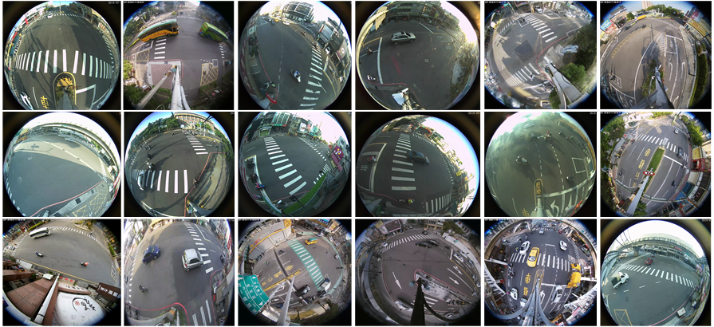

# FishEye8K
FishEye8K: A Benchmark and Dataset for Fisheye Camera Object Detection

We provide detailed information on the new FishEye8K road object detection dataset. The dataset consists of 8,000 annotated images with 157K bounding boxes of five object classes. The figure displays sample images from each of the 18 cameras with wide-angle fisheye views. These cameras offer new possibilities for extensive coverage.

#Dataset Available Link
